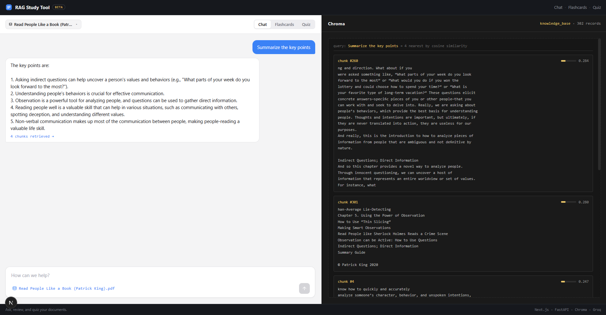
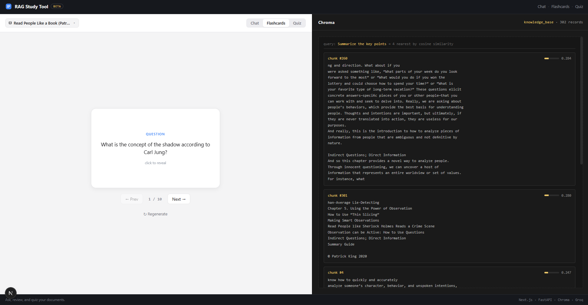
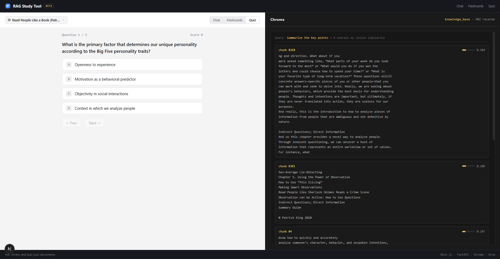

# RAG Study Tool

A study workspace for your PDFs. Upload a document and the app chunks and embeds it
on the fly, stores the vectors in a local ChromaDB, and lets you **chat** with it,
generate **flashcards**, or take an auto-generated **quiz** — all grounded in that
specific document. Answers and study material are generated with the Groq LLM API.

The UI is a split playground: a chat/study panel on the left and a live ChromaDB
inspector on the right that shows exactly which chunks were retrieved for each query,
with cosine-similarity scores — so you can see *why* the model answered the way it did.

## Features

- **Chat** — ask questions; answers stream in token by token and cite the retrieved
  chunks. The conversation is multi-turn: follow-ups ("give me an example of that")
  are rewritten into standalone queries before retrieval, so context carries over.
- **Retrieval inspector** — the right panel shows the nearest chunks with cosine
  similarity scores. Click "N chunks retrieved" on any answer to highlight what it used.
- **Flashcards** — generate a deck of Q&A flip cards sampled across the whole document.
- **Quiz** — take a multiple-choice quiz with instant feedback, explanations, and a score.
- **Multi-document management** — switch between uploaded documents, upload new ones,
  or delete them from the header dropdown. Each collection persists on disk.

## Screenshots

### Chat
Ask questions and inspect the retrieved chunks with similarity scores.



### Flashcards
Generate a deck of flip cards sampled across the document.



### Quiz
Take a multiple-choice quiz with instant feedback and scoring.



## Architecture

```
PDF upload ──> FastAPI backend ──> extract text ──> chunk ──> embed (sentence-transformers)
                                                                   │
                                                                   ▼
Next.js frontend  <── answer / cards / quiz (Groq) <── retrieve chunks <── ChromaDB (persistent)
```

- **frontend/** — Next.js (App Router, TypeScript) UI: split chat / flashcards / quiz
  workspace with a retrieval inspector and document switcher.
- **backend/** — FastAPI service: PDF parsing, chunking, embeddings, Chroma store, and
  Groq-powered RAG, flashcard, and quiz generation.

## Stack

| Concern        | Choice                                     |
| -------------- | ------------------------------------------ |
| Frontend       | Next.js + TypeScript                       |
| Backend        | FastAPI (Python)                           |
| PDF parsing    | pypdf                                      |
| Embeddings     | sentence-transformers (`all-MiniLM-L6-v2`) |
| Vector store   | ChromaDB (persistent, cosine space)        |
| Generation LLM | Groq API                                   |

## API

| Method   | Endpoint               | Purpose                                            |
| -------- | ---------------------- | -------------------------------------------------- |
| `POST`   | `/documents`           | Upload a PDF; chunk, embed, and store it.          |
| `GET`    | `/documents`           | List stored documents (filename + chunk count).    |
| `DELETE` | `/documents/{id}`      | Delete a document's collection and its PDF.        |
| `POST`   | `/chat`                | Ask a question; returns an answer + scored sources.|
| `POST`   | `/chat/stream`         | Same, but streams sources then tokens over SSE.    |
| `POST`   | `/flashcards`          | Generate flashcards from a document.               |
| `POST`   | `/quiz`                | Generate a multiple-choice quiz from a document.   |
| `GET`    | `/health`              | Health check.                                      |

## Getting started

### Backend
```bash
cd backend
python -m venv .venv
.venv\Scripts\activate          # Windows
pip install -r requirements.txt
copy .env.example .env          # then add your GROQ_API_KEY
uvicorn app.main:app --reload
```

Get a free Groq API key at https://console.groq.com/keys. The embedding model is
downloaded once on first run (~90 MB) and warmed up at startup so the first query is fast.

### Frontend
```bash
cd frontend
npm install
copy .env.local.example .env.local
npm run dev
```

Backend runs on http://localhost:8000, frontend on http://localhost:3000.
